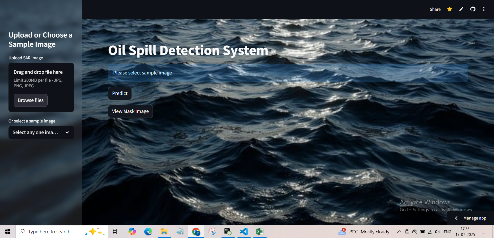

<h3>Porject Name</h3>
<b>Oil Spill Detection</b>

<b>Project Status : Completed</b>
<a href= https://drive.google.com/file/d/1aR4A_QPYJ33yDLZL0L6owi7NUUDhRBAD/view?usp=drive_link>View Demo</a>

 
<b><u>Problem statement :</u></b> Detection of oil spills in vast ocean is an time consuming and inaccurate process. Most of the process is done by manual monitoring and satellite-based techniques which are often slow, prone to human error, and lack scalability. 

<b><u>Project objectives:</u></b> Built a machine learning model with Convolutional Neural Network which can identify the oil spilled sites by reciving ocean surface images from satellite. 

<b>Need of Project</b>
<ul> 
<li>  
Oil spills pose a significant threat to marine ecosystems. Traditional methods of oil spill detection, such as manual visual inspection or radar analysis, often suffer from limitations including high operational costs, slow response times, and susceptibility to human error. 
</li>
<li>  
Rapid and accurate detection of oil spills is essential to minimize environmental damage and reduce economic loss. Convolutional Neural Networks (CNNs), offer a powerful solution for this problem.
</li> 
<li>CNNs can be use to automatically learn and extract complex features from image data, making them highly effective for detecting oil spills in diverse marine environments in real-time, ensuring quicker response and reducing reliance on labor-intensive methods.
</li>
</ul>

<b>Datasets :</b> 
<ul>
<li>Synthetic Aperture Radar (SAR) imagery from the Sentinel-1 satellite is used as the primary dataset for detecting oil spills. The imagery was accessed through the Copernicus Open Access Hub, a publicly available platform that provides free and continuous access to Sentinel-1 data.
</li> 
<li> 
These events were geolocated and time-matched to identify the appropriate satellite passes that captured the spill areas. The selected SAR images were primarily taken in Interferometric Wide (IW) imagning mode with dual-polarization (VV and VH).
</li> 
<li> 
Sentinel-1, developed by the European Space Agency under the Copernicus program, provides high-resolution, dual-polarization SAR data. SAR works by actively transmitting microwave signals toward the Earth's surface and measuring the intensity and timing of the signals that are reflected back. 
</li> 
<li> 
Since SAR uses microwave radiation, it can penetrate through clouds and operate at night, making it highly reliable for real-time environmental surveillance. Oil spills appear as dark patches in SAR images due to the damping of surface waves, which reduces the radar backscatter signal.
</li>
</ul>

<b>library used :</b>  
<ul>
<li>Tensorflow</li>
<li>Sciket learn</li>
<li>Opencv</li>
<li>Pandas</li>
<li>Numpy</li>
<li>PIL</li>
<li>Shutil</li>
<li>Keras</li>
<li>Matplotlib</li>
</ul>

<b>deep learning model used :</b>  
<ul>
<li>Convolution Neural Network (Image Classification)</li>
<li>YoloV8 (Image Segmentation)</li>
</ul>

<u>Methdology</u>

<b>Data Preprocessing :</b>  

Data Modeling: 
Model Evaluation: 
<b>Model Deployment:</b> 

